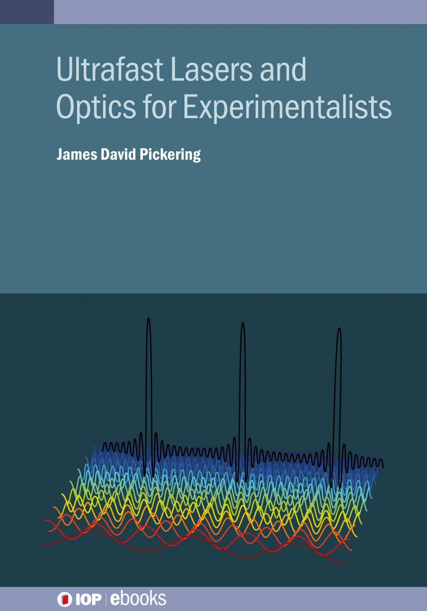

Hello! My name is James and I'm a physical chemist. This site primarily exists as a repository for various research/teaching related materials that I've made over the years. You've probably found it as you're a student/ex-student of mine and I sent you the link when you asked me for some lecture notes (or something). 

Currently, I work at Aarhus University in Surflab with Tobias Weidner. I've previously worked with Michael Burt at the University of Oxford (postdoc), Henrik Stapelfeldt at Aarhus University (PhD), and Mark Brouard at the University of Oxford (MChem). 

I have a long standing interest and passion for scientific education, and I've previously held lectureships and teaching fellowships at the Universities of Oxford and Leicester respectively, teaching physical chemistry, physics, and mathematics to undergraduate chemistry students. Having done this for some years, I've accumulated quite a lot of teaching materials which mostly sit isolated in my Dropbox until someone asks for them. Hopefully hosting them here will mean they can be of more use to more people! 

Recently I have published a <a href="https://iopscience.iop.org/book/978-0-7503-3659-8"> short book about ultrafast lasers and optics </a> through IOP ebooks. The aim of the book is to serve as a primer for anyone who (like me) is entering a laser spectroscopy/dynamics group without any serious formal background in laser physics or optics. Many laser physics textbooks are very physics-y (and excellent for it), but do tend to start their opening chapters with sentences like: "consider an infinitely large cavity in a 3D k-space". This immediately turns off anyone with a background in chemistry or biology that may want to know more about the tools they are using day to day. This book aims to fill the gap so that a) people can get up to speed in the lab quickly, and b) those excellent laser physics textbooks become accesible. 

There are probably still typos/errors in the book, so get in contact if you find any and I'll host an errata PDF here. You can contact me at pickering DOT jamesd AT gmail DOT com, or <a href="https://www.linkedin.com/in/james-d-pickering/"> via Linkedin </a>.

